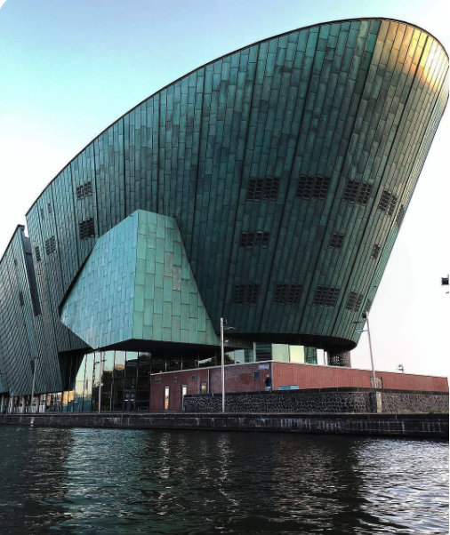

# stockmarket

### We are the Megalomanics!

## Objective

Stock Market Forecasting!

Using machine learning to examine the effectiveness of the following potential features in accurately predicting future stock market trends: 

- stock volatility
- timing factors
- consumer confidence
- Stock Volume
- Banding
- Interactive effects of the above variables

## Analysis Code

Our clean-up and subsequent analysis code is featured on the stock_market_run_data notebook.

We pulled stock data datasets from quandl by company ticker name, and pulled predictor datasets from various websites.

We cleaned data sets accordingly and defined our predictor values, subject to datetime. We then tested machine learning models per each company, 
comparing the r-square values to determine efficacy of the said models.

We collated the graphs and exported any relevant raw datasets, furnished datasets and graphs to our startdata folder.

## Data and Graphs

We stored our raw data and initial output graphs into the /startdata folder

In order to reduce clutter, we decided to remove the majority of our initial output data, leaving a couple examples of output data
so that readers can understand what sort of raw datasets and graphs we were creating without being overwhelmed. 

Note that the final graphs and tables are posted in our presentation website. The files in the startdata folder rapid test files and sanity checks.

These include:

1. Raw data for cleaned data sets for various predictors

    - [x] OECD_dasta_2008_to_2020.csv
    
2. Original stocks dataframe from Quandl

    - [x] stocks.csv
    
3. Our initial merged dataset from stock data and cleaned predictor data

    - [x] investment_tech_data
    
4. Initial residual graphs showing machine learning predictor results

    - [x] Apple_residual_graph.png
    
    - [x] Apple_residual_volatility_graph.png
    
    - [x] Ford_residual_graph.png

## Images Folder

Our /images folder contains graphics for our website that hosts our presentation for the project.

## Website Folder

We created a github.io hosted website to showcase our work.  Link below:

[Click to see our presentation website](https://vk8895.github.io/vk8895-final.github.io/index.html#)
